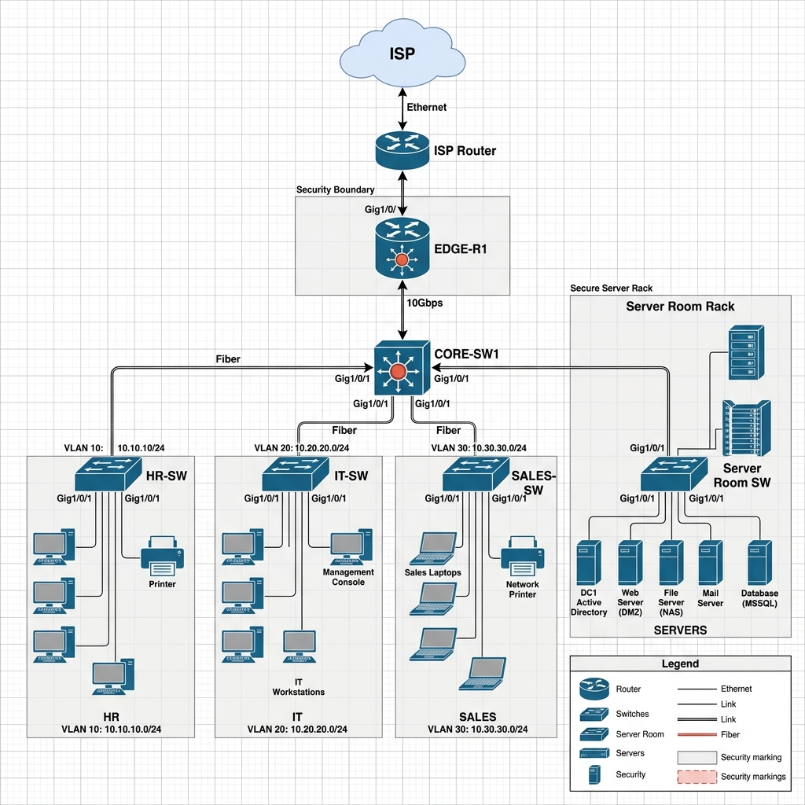

# 📘 Secure Enterprise College Network
## CCNA Cisco Packet Tracer Project



---

## 🎯 Project Goal
A fully functional, secure enterprise college network built in Cisco Packet Tracer implementing **15 networking protocols** covering routing, switching, security, wireless, and network services.

---

## 📋 15 Protocols Implemented
| # | Protocol | Purpose |
|:---:|:---|:---|
| 01 | VLANs | Department-wise segmentation (5 VLANs) |
| 02 | VTP | Automatic VLAN propagation |
| 03 | Inter-VLAN Routing | Router on a Stick (RoAS) |
| 04 | DHCP | Automatic IP assignment |
| 05 | DNS | Name resolution |
| 06 | HTTP | College website hosting |
| 07 | Email | Internal email service |
| 08 | NAT/PAT | Internet access for all |
| 09 | OSPF | Dynamic routing (Area 0) |
| 10 | ACLs | Security — block unauthorized access |
| 11 | SSH | Encrypted remote management |
| 12 | Port Security | Prevent rogue devices |
| 13 | STP | Loop prevention |
| 14 | NTP | Time synchronization |
| 15 | WPA2 | Secure wireless authentication |

---

## 🌐 VLAN & IP Plan
| Department | VLAN | Subnet | Gateway | Switch |
|:---|:---:|:---|:---|:---|
| HR | 10 | `10.10.10.0/24` | `10.10.10.1` | HR-SW |
| IT | 20 | `10.20.20.0/24` | `10.20.20.1` | IT-SW |
| SALES | 30 | `10.30.30.0/24` | `10.30.30.1` | SALES-SW |
| SERVERS | 40 | `10.40.40.0/24` | `10.40.40.1` | SERVER-SW |
| MANAGEMENT | 99 | `10.99.99.0/24` | `10.99.99.1` | All Switches |

---

## 🖥️ Server IP Map
| Server | IP | Service |
|:---|:---|:---|
| DC1 | `10.40.40.10` | DNS + NTP |
| Web Server | `10.40.40.11` | HTTP (college website) |
| File Server | `10.40.40.12` | File sharing |
| Mail Server | `10.40.40.13` | SMTP Email |
| Database | `10.40.40.14` | MSSQL |

---

## 📁 Project Structure
```
CCNA-College-Network/
├── README.md                    ← This file
├── PROTOCOLS.md                 ← Full 15 protocol documentation
├── SERVERS_SETUP.md             ← GUI setup guide for servers & wireless
├── network_topology.png         ← Network diagram
└── configs/
    ├── ISP-Router.txt           ← ISP Router (Simulated WAN, DHCP for Edge Router)
    ├── EDGE-R1.txt              ← Edge Router (RoAS, DHCP, OSPF, NAT, ACL, SSH, NTP)
    ├── CORE-SW1.txt             ← Core Switch (VTP Server, VLANs, Trunks, STP Root)
    ├── HR-SW.txt                ← HR Access Switch (VTP Client, Port Security)
    ├── IT-SW.txt                ← IT Access Switch (VTP Client, Port Security)
    ├── SALES-SW.txt             ← Sales Access Switch (VTP Client, Port Security)
    └── SERVER-SW.txt            ← Server Room Switch (VTP Client, Strict Port Security)
```

---

## 📋 Build Order
```
Step 1  → CORE-SW1     VTP Server, VLANs, Trunks, STP Root
Step 2  → HR-SW        VTP Client, Access Ports, Port Security
Step 3  → IT-SW        VTP Client, Access Ports, Port Security
Step 4  → SALES-SW     VTP Client, Access Ports, Port Security
Step 5  → SERVER-SW    VTP Client, Server Ports, Strict Port Security
Step 6  → Wireless AP  Add WAP to Sales area → WPA2 config (GUI)
Step 7  → EDGE-R1      RoAS, DHCP, OSPF, NAT/PAT, ACLs, SSH, NTP
Step 8  → ISP-Router   Simulated WAN, DHCP for EDGE-R1, Cloud L2 bridge
Step 9  → DC1 Server   Enable DNS + NTP services (GUI)
Step 10 → Web Server   Enable HTTP + add college website HTML (GUI)
Step 11 → Mail Server  Enable Email + create user accounts (GUI)
Step 12 → PCs/Laptops  Set to DHCP — verify IP assignment
Step 13 → Verify ALL   Run all verification commands
```

---

## 🔑 Credentials
| Type | Value |
|:---|:---|
| Enable Secret | `Cisco123` |
| SSH Username | `admin` |
| SSH Password | `Cisco123` |
| VTP Domain | `COLLEGE` |
| VTP Password | `Cisco123` |
| WiFi SSID | `COLLEGE-SALES` |
| WiFi Password | `College@2024` |

---

## ✅ Quick Verification Commands
```cisco
! On any switch:
show vlan brief
show vtp status
show interfaces trunk
show port-security
show spanning-tree

! On EDGE-R1:
show ip route
show ip ospf neighbor
show ip nat translations
show ip dhcp binding
show access-lists
show clock
show ntp status

! Ping tests from any PC:
ping 10.40.40.11    ! Web Server
ping 10.40.40.10    ! DC1 / DNS Server
ping 8.8.8.8        ! Internet (via NAT)
```

---
*CCNA Portfolio Project — Secure Enterprise College Network*
